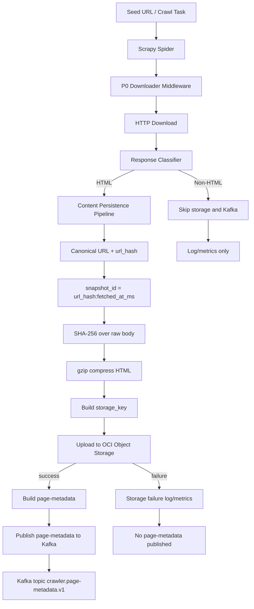

# P1 执行链路与数据流

## 目标边界

P1 只交付 producer 链路和契约：

```text
Scrapy worker -> Oracle Cloud Object Storage -> Kafka
```

P1 不包含：

- PostgreSQL 消费者。
- ClickHouse 消费者。
- 下游解析服务。
- 本地 outbox。
- 旧对象删除。
- 完整 outlink 列表 topic。

## 主链路



## 详细步骤

1. Scrapy spider 产生请求。
2. P0 middleware 选择本地出口 IP，写入 `bindaddress`、`egress_local_ip` 和 Host/IP 健康状态。
3. Scrapy downloader 获取响应。
4. P1 pipeline 判断响应类型：
   - HTML 或 `text/html`：进入内容持久化链路。
   - 字体、JavaScript、CSS、图片、PDF、二进制等非 HTML：不写对象存储，不发布 Kafka，只记录日志和指标。
5. 对 HTML 响应计算 canonical URL。
6. 基于 canonical URL 计算 `url_hash`。
7. 生成 `snapshot_id = {url_hash}:{fetched_at_ms}`。
8. 对未压缩 HTML body 计算 `content_sha256`。
9. 使用 gzip 压缩 HTML。
10. 生成对象存储 key。
11. 上传到 Oracle Cloud Object Storage。
12. 上传成功后发布 `page-metadata`。

## 对象存储写入

配置：

| 项目 | 值 |
|------|----|
| bucket | `clawer_content_staging` |
| namespace | `axfwvgxlpupm` |
| region | `us-phoenix-1` |
| endpoint | `https://objectstorage.us-phoenix-1.oraclecloud.com` |
| 认证方式 | `OCI_AUTH_MODE=api_key` 用于开发，`OCI_AUTH_MODE=instance_principal` 用于生产 |
| 压缩 | `gzip` |

业务 pipeline 只依赖统一 storage client。认证分支封装在 OCI storage client 工厂内，pipeline 不感知 API Key 或 Instance Principal。

建议 storage key：

```text
pages/v1/{yyyy}/{mm}/{dd}/{host_hash}/{url_hash}/{snapshot_id}.html.gz
```

P1 不删除旧对象。旧对象清理由 P2 处理；metadata/DB 层后续按 `url_hash` 保留最新快照。

## Kafka 写入

配置：

| 项目 | 值 |
|------|----|
| bootstrap_servers | `bootstrap-clstr-hcpqnx0ycdc2ds5o.kafka.us-phoenix-1.oci.oraclecloud.com:9092` |
| security_protocol | `SASL_SSL` |
| sasl_mechanism | `SCRAM-SHA-512` |
| sasl_username | 环境变量注入 |
| sasl_password | 环境变量注入 |
| ssl_ca_location | `/etc/pki/tls/certs/ca-bundle.crt` |
| batch_size | `100` |
| topic 自动创建 | 允许 |

## gzip 存储语义

P1 将 HTML 内容压缩为 gzip 字节后，以 `.html.gz` 对象归档保存。对象上传时不设置 HTTP `Content-Encoding: gzip`，避免 OCI SDK 或 HTTP 客户端在读取时自动解压，导致下游无法稳定判断对象字节是否仍为 gzip 格式。

压缩格式通过两处表达：

- 对象 metadata：`compression=gzip`
- Kafka `page-metadata`：`compression=gzip`

默认 topic：

| topic | 用途 | message key |
|-------|------|-------------|
| `crawler.page-metadata.v1` | HTML 页面快照 metadata | `snapshot_id` |

`crawl-events` 当前没有消费方，P1 不发布该 topic；后续如进入分析链路，可在 P2 单独启用。

## 失败语义

### 对象存储上传失败

- 不发布 `page-metadata`。
- 记录结构化日志和 Prometheus 指标。

### Kafka 发布失败

- P1 不实现本地 outbox。
- producer 按配置做内存内 retry。
- 失败后记录结构化日志和 Prometheus 指标。
- 如果 HTML 已上传但 metadata 未发布，P1 不承诺本地持久补偿；补偿依赖后续重抓或 P2 reconciliation。

## 下游幂等

- `url_hash`：canonical URL 的稳定 hash，表示逻辑页面。
- `snapshot_id`：`{url_hash}:{fetched_at_ms}`，表示一次页面快照。
消费端预期：

- `page-metadata` 可按 `snapshot_id` 去重，按 `url_hash` upsert 最新快照。

## 数据可见性顺序

P1 的强约束：

```text
HTML object upload success -> page-metadata publish
```

因此下游只要看到 `page-metadata`，就应该能用 `storage_key` 读取对象存储内容。
