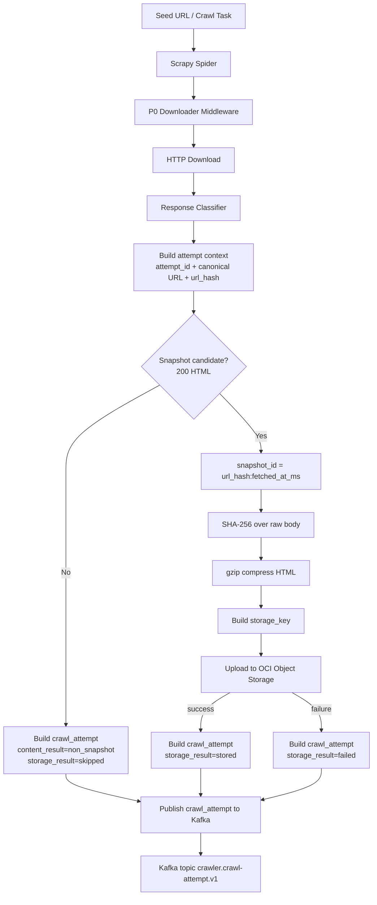
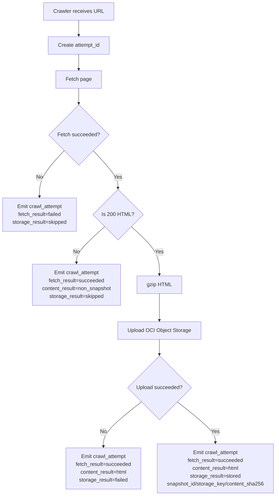
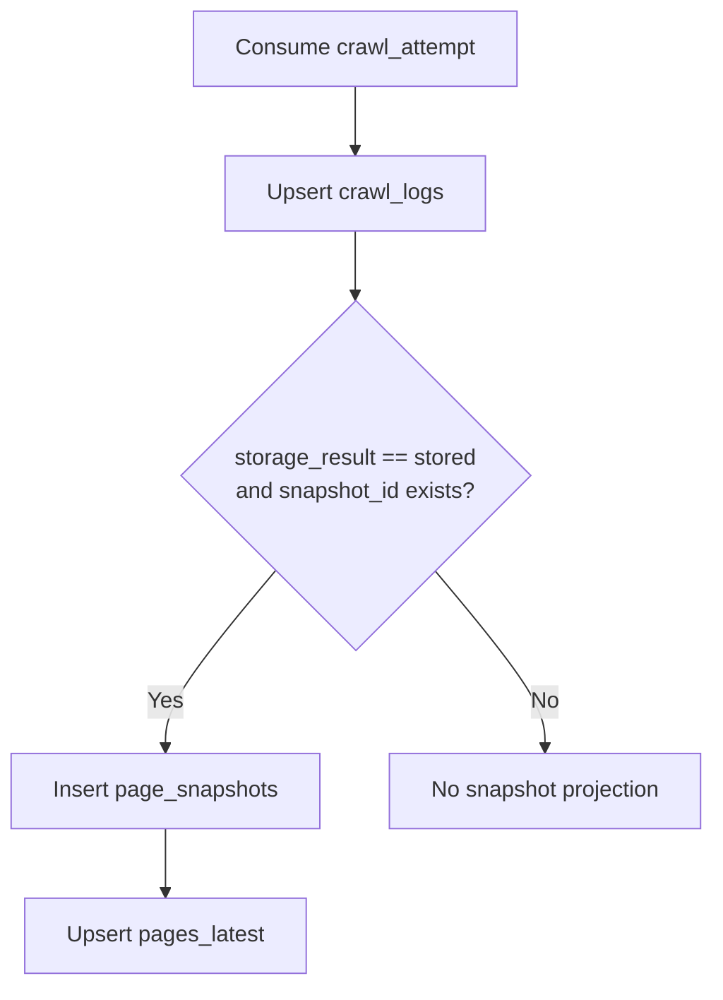

# P1 执行链路与数据流

## 目标边界

P1 只交付 producer 链路和契约：

```text
Scrapy worker -> Oracle Cloud Object Storage (仅 HTML 快照) -> Kafka crawl_attempt
```

P1 不包含：

- PostgreSQL 消费者。
- ClickHouse 消费者。
- 下游解析服务。
- 本地 outbox。
- 旧对象删除。
- 完整 outlink 列表 topic。

## 主链路



## 详细步骤

1. Scrapy spider 产生请求。
2. P0 middleware 选择本地出口 IP，写入 `bindaddress`、`egress_local_ip` 和 Host/IP 健康状态。
3. Scrapy downloader 获取响应。
4. P1 pipeline 构造 attempt context：`attempt_id`、canonical URL、`url_hash`、fetch 结果和基础响应信息。
5. P1 pipeline 判断响应类型：
   - HTTP 200 HTML 或 `text/html`：进入内容持久化链路。
   - 非 200、字体、JavaScript、CSS、图片、PDF、二进制等非 HTML：不写对象存储，但发布 `crawl_attempt`，标记 `content_result=non_snapshot`、`storage_result=skipped`。
6. 对 HTML 快照候选响应生成 `snapshot_id = {url_hash}:{fetched_at_ms}`。
7. 对未压缩 HTML body 计算 `content_sha256`。
8. 使用 gzip 压缩 HTML。
9. 生成对象存储 key。
10. 上传到 Oracle Cloud Object Storage。
11. 上传成功后发布 `storage_result=stored` 的 `crawl_attempt`。
12. 上传失败后发布 `storage_result=failed` 的 `crawl_attempt`，不携带可用快照语义。

## 对象存储写入

配置：

| 项目 | 值 |
|------|----|
| bucket | `clawer_content_staging` |
| namespace | `axfwvgxlpupm` |
| region | `us-phoenix-1` |
| endpoint | `https://objectstorage.us-phoenix-1.oraclecloud.com` |
| 认证方式 | `OCI_AUTH_MODE=api_key` 用于开发，`OCI_AUTH_MODE=instance_principal` 用于生产 |
| 压缩 | `gzip` |

业务 pipeline 只依赖统一 storage client。认证分支封装在 OCI storage client 工厂内，pipeline 不感知 API Key 或 Instance Principal。

建议 storage key：

```text
pages/v1/{yyyy}/{mm}/{dd}/{host_hash}/{url_hash}/{snapshot_id}.html.gz
```

P1 不删除旧对象。旧对象清理由 P2 处理；metadata/DB 层后续按 `url_hash` 保留最新快照。

## Kafka 写入

配置：

| 项目 | 值 |
|------|----|
| bootstrap_servers | `bootstrap-clstr-hcpqnx0ycdc2ds5o.kafka.us-phoenix-1.oci.oraclecloud.com:9092` |
| security_protocol | `SASL_SSL` |
| sasl_mechanism | `SCRAM-SHA-512` |
| sasl_username | 环境变量注入 |
| sasl_password | 环境变量注入 |
| ssl_ca_location | `/etc/pki/tls/certs/ca-bundle.crt` |
| batch_size | `100` |
| topic 自动创建 | 允许 |

## gzip 存储语义

P1 将 HTML 内容压缩为 gzip 字节后，以 `.html.gz` 对象归档保存。对象上传时不设置 HTTP `Content-Encoding: gzip`，避免 OCI SDK 或 HTTP 客户端在读取时自动解压，导致下游无法稳定判断对象字节是否仍为 gzip 格式。

压缩格式通过两处表达：

- 对象 metadata：`compression=gzip`
- Kafka `crawl_attempt`：`compression=gzip`

默认 topic：

| topic | 用途 | message key |
|-------|------|-------------|
| `crawler.crawl-attempt.v1` | 一次抓取 attempt 的完整事实 | `attempt_id` |
| `crawler.page-metadata.v1` | P1 第一版已验证的 HTML 页面快照 metadata | `snapshot_id` |

`crawl-events` 当前不作为独立 topic 发布；P1 调整后的目标是用 `crawl_attempt` 承载抓取行为、内容分类和对象存储结果。

## 失败语义

### 对象存储上传失败

- 发布 `crawl_attempt`，`storage_result=failed`。
- 不产生可用 `page_snapshots` 投影。
- 记录结构化日志和 Prometheus 指标。

### Kafka 发布失败

- P1 不实现本地 outbox。
- producer 按配置做内存内 retry。
- 失败后记录结构化日志和 Prometheus 指标。
- 如果 attempt 已完成但 `crawl_attempt` 未发布，P1 不承诺本地持久补偿；补偿依赖后续重抓或 P2 reconciliation。

## 下游幂等

- `url_hash`：canonical URL 的稳定 hash，表示逻辑页面。
- `attempt_id`：一次抓取意图的幂等键，作为 Kafka message key；Scrapy 内部 retry 归属于同一个 `attempt_id`。
- `snapshot_id`：`{url_hash}:{fetched_at_ms}`，仅在成功 HTML 快照时存在。
消费端预期：

- `crawl_attempt` 可按 `attempt_id` 去重。
- `page_snapshots` 可按 `snapshot_id` 去重。
- `pages_latest` 可按 `url_hash` upsert 最新可读取快照。

关系：

```text
url_hash   1 -> N attempt_id
attempt_id 1 -> 0..1 snapshot_id
```

## 数据可见性顺序

P1 的强约束：

```text
HTML object upload success -> crawl_attempt publish with storage_result=stored
```

因此下游只要看到 `storage_result=stored` 的 `crawl_attempt`，就应该能用 `storage_key` 读取对象存储内容。

## 消费端投影

P1 第一版已经完成 `page-metadata` producer 链路。按调整后的计划，P1 事件模型应收敛为单一 `crawl_attempt` 事件，而不是分别发布 `crawl_logs` 事件和 `page_snapshots` 事件。

设计理由：

- 一次抓取 attempt 与 OSS 上传结果属于同一个执行流程。
- 下游只消费一条 attempt 事件，就能获得抓取行为、内容分类、对象存储结果和可选快照字段。
- 避免 `crawl_logs` 与 `page_snapshots` 两类事件乱序到达，导致消费端需要复杂补偿。
- `crawl_logs`、`page_snapshots` 和 `pages_latest` 应作为数据库侧投影，而不是 producer 侧多个并列事件。

调整后的 producer flow：



消费端投影：



语义关系：

```text
attempt_id 1 -> 1 crawl_logs
attempt_id 1 -> 0..1 page_snapshots
url_hash   1 -> 0..1 pages_latest
```

`crawl_logs` 记录 attempt 事实，不依赖 page snapshot 投影是否成功。`page_snapshots` 只在 `storage_result=stored` 且对象可读取时生成。`pages_latest` 只从成功快照更新，失败 attempt 不覆盖最新可用页面。
